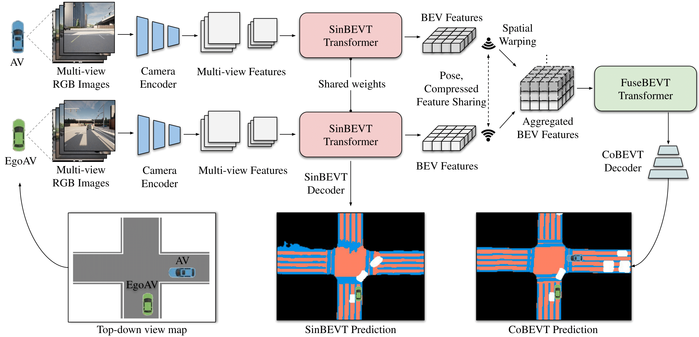

# CoBEVT: Cooperative Bird's Eye View Semantic Segmentation with Sparse Transformers [CORL2022] 

[](https://arxiv.org/pdf/2207.02202.pdf)
[](https://arxiv.org/pdf/2207.02202.pdf)
[]()

This is the official implementation of CoRL2022 paper "CoBEVT: Cooperative Bird's Eye View Semantic Segmentation with Sparse Transformers".
[Runsheng Xu](https://derrickxunu.github.io/), [Zhengzhong Tu](https://github.com/vztu), [Hao Xiang](https://xhwind.github.io/), [Wei Shao](https://www.linkedin.com/in/wei-shao-94972295/), [Bolei Zhou](https://boleizhou.github.io/), [Jiaqi Ma](https://mobility-lab.seas.ucla.edu/)

UCLA, UT-Austin

<br>

<div align="center"></div>
<div align="center">
<b>Overview of CoBEVT</b>
</div>
<br>


## Introduction
CoBEVT is the first generic multi-agent multi-camera perception framework that can cooperatively generate BEV
map predictions. The core component of CoBEVT, named fused axial
attention or FAX module,  can capture sparsely local and global spatial interactions across views and agents. We 
achieve SOTA performance both on [OPV2V](https://mobility-lab.seas.ucla.edu/opv2v/) and [nuScenes](https://www.nuscenes.org/) dataset with **real-time performance**.

<br>

<div align="center"></div>
<div align="center">
<b>nuScenes demo:</b>
Our CoBEVT can be used on single-vehicle multi-camera semantic BEV Segmentations.
</div>
<br>

<br>

<div align="center"></div>
<div align="center">
<b>OPV2V demo:</b>
Our CoBEVT can also be used for multi-agent BEV map prediction.
</div>
<br>

## Installation
The pipeline for nuScenes dataset and OPV2V dataset is different. Please refer to the specific folder for more details based on your research purpose.

:point_right: [nuScenes Users](nuscenes) <br/>
:point_right: [OPV2V Users](opv2v)


## Models

<details>
  <summary><strong>Fused Axial Attention Module (FAX)</strong> (click to expand) </summary>


</details>

<details>
  <summary><strong>SinBEVT (single-agent multi-view fusion) and FuseBEVT (multi-agent BEV fusion) </strong> (click to expand) </summary>


</details>

<details>
  <summary><strong>CoBEVT Architecture</strong> (click to expand) </summary>


</details>


## Results

<details>
  <summary><strong>Main results (OPV2V-camera, -LiDAR, and nuScenes.)</strong> (click to expand) </summary>


</details>

<details>
  <summary><strong>Qualitative results on OPV2V-camera</strong> (click to expand) </summary>


 


</details>


<details>
  <summary><strong>Qualitative results on OPV2V-LiDAR</strong> (click to expand) </summary>


</details>


<details>
  <summary><strong>Qualitative results on nuScenes</strong> (click to expand) </summary>


</details>


<details>
  <summary><strong>Ablation study</strong> (click to expand) </summary>


</details>


## Citation
 ```bibtex
@inproceedings{xu2022cobevt,
  author = {Runsheng Xu, Zhengzhong Tu, Hao Xiang, Wei Shao, Bolei Zhou, Jiaqi Ma},
  title = {CoBEVT: Cooperative Bird's Eye View Semantic Segmentation with Sparse Transformers},
  booktitle={Conference on Robot Learning (CoRL)},
  year = {2022}}
@article{xu2022v2x,
  title={V2X-ViT: Vehicle-to-everything cooperative perception with vision transformer},
  author={Xu, Runsheng and Xiang, Hao and Tu, Zhengzhong and Xia, Xin and Yang, Ming-Hsuan and Ma, Jiaqi},
  journal={Proceedings of the European Conference on Computer Vision (ECCV)},
  year={2022}
}
@inproceedings{tu2022maxim,
  title={Maxim: Multi-axis mlp for image processing},
  author={Tu, Zhengzhong and Talebi, Hossein and Zhang, Han and Yang, Feng and Milanfar, Peyman and Bovik, Alan and Li, Yinxiao},
  booktitle={Proceedings of the IEEE/CVF Conference on Computer Vision and Pattern Recognition},
  pages={5769--5780},
  year={2022}
}
@article{tu2022maxvit,
  title={Maxvit: Multi-axis vision transformer},
  author={Tu, Zhengzhong and Talebi, Hossein and Zhang, Han and Yang, Feng and Milanfar, Peyman and Bovik, Alan and Li, Yinxiao},
  journal={Proceedings of the European Conference on Computer Vision (ECCV)},
  year={2022}
}
```

## Acknowledgement
CoBEVT is build upon [OpenCOOD](https://github.com/DerrickXuNu/OpenCOOD), which is the first Open Cooperative Detection framework for autonomous driving.

Our nuScenes experiments used the training pipeline in [CVT(CVPR2022)](https://github.com/bradyz/cross_view_transformers).

CoBEVT is partly inspired by [V2X-ViT](https://github.com/DerrickXuNu/v2x-vit), [MAXIM](https://github.com/google-research/maxim) and [MaxViT](https://github.com/google-research/maxvit).
